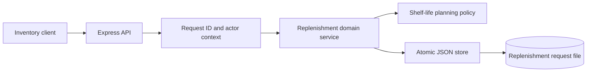
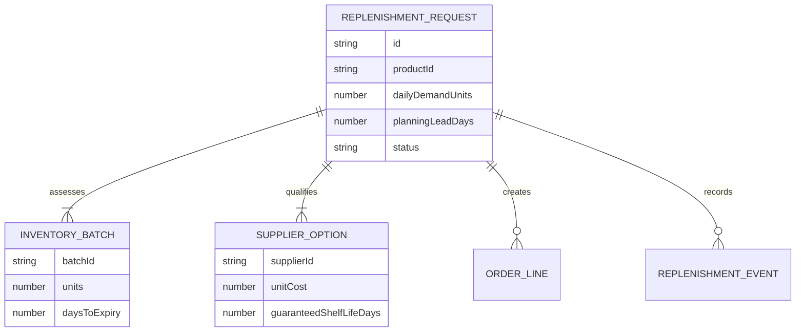
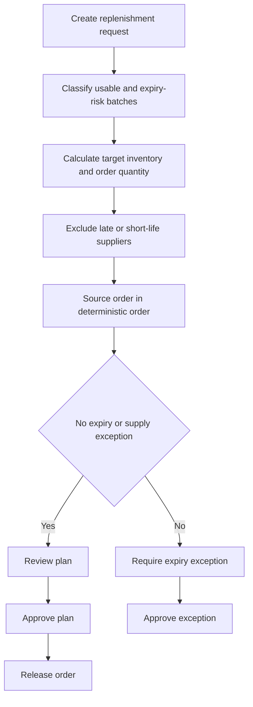
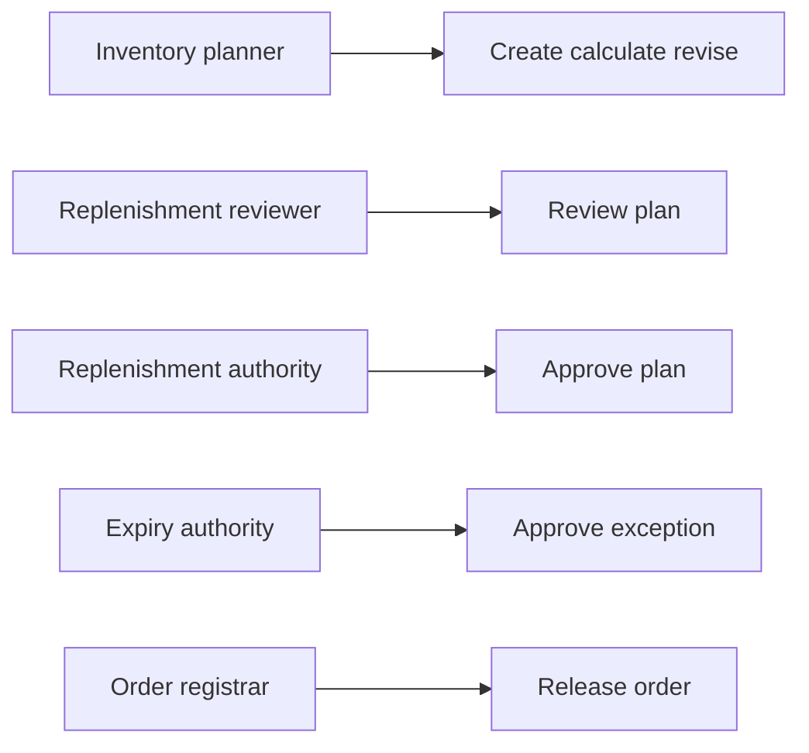
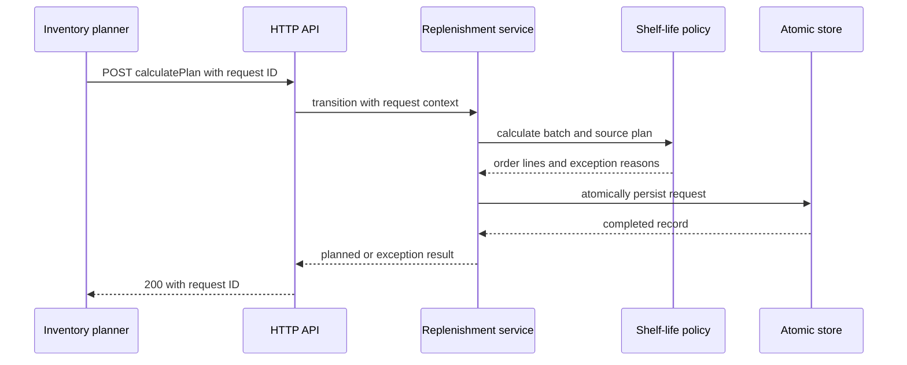

# Inventory Shelf-Life Replenishment Planning Engine

## The Problem

Inventory planners can calculate reorder quantities from current units while missing the fact that some batches will expire before they are consumed. A lowest-cost supplier can also be unsuitable when its delivered shelf life cannot cover the lead and review horizon. These blind spots cause stockouts, preventable disposal, and replenishment decisions that cannot explain why certain suppliers were excluded.

## The Solution

This engine models every on-hand batch against the replenishment lead time and review horizon. It separates usable stock from expiry-risk stock, projects availability at arrival, calculates the target inventory level from demand and safety days, and produces the required order quantity. Supplier options are then excluded when their lead time or guaranteed shelf life fails the policy horizon and assigned in deterministic cost order.

The result records batch exposure, demand coverage, qualified sources, expected order cost, and any exception reason. Standard plans progress through review, approval, and order release. Expiry-risk or insufficient-source plans enter an exception route. All accepted commands carry a request identifier, create an audit event, and atomically replace the current state file.

## Live Demo and Tech Stack

The engine supports local and approved LAN operation. After startup, `http://127.0.0.1:65074/health` returns the health response. The source repository is [inventory-shelf-life-replenishment-planning-engine](https://github.com/kholipha-ahmmad-al-amin/inventory-shelf-life-replenishment-planning-engine).

| Layer | Implementation |
| --- | --- |
| Runtime | Node.js 22 with ECMAScript modules |
| HTTP service | Express 5 |
| Planner | Batch usability, expiry exposure, target stock, and qualified-source sourcing |
| Governance | Review, approval, release, exception authorization, and controlled revision |
| Persistence | JSON store with temporary write and atomic rename |
| Quality checks | Vitest, Supertest, syntax checks, and GitHub Actions |

## Local Setup and Run Instructions

Clone and validate the service with the following commands.

```bash
git clone https://github.com/kholipha-ahmmad-al-amin/inventory-shelf-life-replenishment-planning-engine.git
cd inventory-shelf-life-replenishment-planning-engine
npm ci
npm run check
npm test
PORT=65074 npm start
```

For an approved workstation on the same network, replace `SERVER_LAN_IP` with the host address.

```bash
curl http://SERVER_LAN_IP:65074/health
```

Create a replenishment request with inventory batches and supplier shelf-life commitments.

```bash
curl -X POST http://127.0.0.1:65074/replenishment-requests \
  -H 'content-type: application/json' \
  -H 'x-actor-id: planner-01' \
  -H 'x-actor-role: inventory_planner' \
  -H 'x-request-id: replenish-create-001' \
  -d '{"productId":"PRD-100","productName":"Cold Chain Ingredient","dailyDemandUnits":20,"planningLeadDays":3,"reviewPeriodDays":7,"safetyDays":2,"onHandBatches":[{"batchId":"B-1","units":100,"daysToExpiry":20},{"batchId":"B-2","units":30,"daysToExpiry":8}],"supplierOptions":[{"supplierId":"SUP-A","supplierName":"Fresh Supply","availableUnits":200,"unitCost":5,"leadDays":2,"guaranteedShelfLifeDays":21}]}'
```

Use `POST /replenishment-requests/:id/:action` for later operations. Every operation requires a unique `x-request-id`, actor identity, specified role, and nonempty JSON `note`. `reviseRequest` accepts a complete replacement request plus the note.

| Action | Required role | Required current state | Resulting state |
| --- | --- | --- | --- |
| `calculatePlan` | `inventory_planner` | `draft` | `planned` or `exception_required` |
| `reviewPlan` | `inventory_replenishment_reviewer` | `planned` | `reviewed` |
| `reviseRequest` | `inventory_planner` | `reviewed` or `exception_required` | `draft` |
| `approvePlan` | `inventory_replenishment_authority` | `reviewed` | `approved` |
| `releaseOrder` | `inventory_order_registrar` | `approved` | `released` |
| `approveException` | `inventory_expiry_authority` | `exception_required` | `exception_approved` |

## System Documentation

The planner applies batch and delivered-shelf-life constraints before it permits a routine replenishment order. Design and operator guidance is available in [docs/architecture.md](docs/architecture.md) and [docs/operations-runbook.md](docs/operations-runbook.md).











## Owner

Created and maintained by Kholipha Ahmmad Al-Amin .

Software Engineer and AI Specialist

Founder and CEO of EquiSaaS BD

Principal Consultant at AR IT Consultancy

Full Stack Developer and SaaS Product Builder

Official links

Portfolio: https://kholipha-ahmmad-al-amin.equisaas-bd.com/

GitHub: https://github.com/kholipha-ahmmad-al-amin

LinkedIn: https://www.linkedin.com/in/kholipha-ahmmad-al-amin

X: https://x.com/al_amin5519

Facebook: https://www.facebook.com/kholipha.ahmmad.al.amin

Instagram: https://www.instagram.com/kholipha.ahmmad.al.amin

## Ownership

This project was created and is maintained by Kholipha Ahmmad Al-Amin.
